# RadioRec

**RadioRec** is a multi-platform desktop application for playing and recording internet radio streams.

Written in Java (using Apache NetBeans) with a Swing-based GUI, it features a user-friendly interface, scheduled recording capabilities, and a powerful tool for parsing station program guides directly from websites.

<p align="center">
  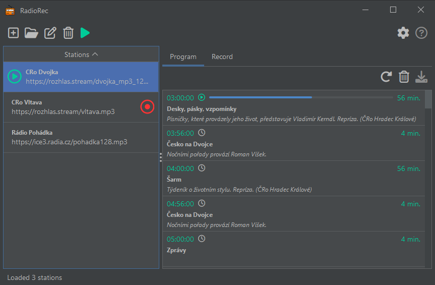<br>
  <small>Dark theme</small>
</p>

<p align="center">
  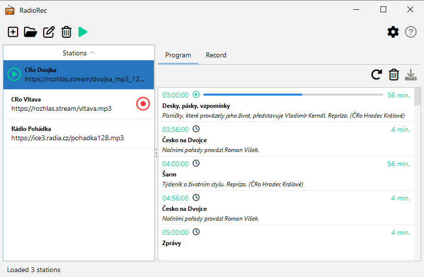<br>
  <small>Light theme</small>
</p>

The installers for this application were created using [Java Build Farm](https://github.com/MarelisAdlatus/java-build-farm) scripts on a "farm" with virtual machines in the Proxmox Virtual Environment.

## Table of Contents

- [Key Features](#key-features)
- [Planned Features](#planned-features)
- [Installation](#installation)
  - [Windows 10 / 11 Installation](#windows-10--11-installation)
    - [Option 1: Installer (Recommended)](#option-1-installer-recommended)
    - [Option 2: Portable (.zip)](#option-2-portable-zip)
  - [Linux Installation](#linux-installation)
    - [Option 1: .deb Package (Ubuntu, Mint, Debian)](#option-1-deb-package-ubuntu-mint-debian)
    - [Option 2: .rpm Package (Fedora, openSUSE, Rocky)](#option-2-rpm-package-fedora-opensuse-rocky)
    - [Option 3: Portable `.tar.gz` / `.zip` (All Linux)](#option-3-portable-targz--zip-all-linux)
- [Usage & Core Components](#usage--core-components)
  - [Main Window](#main-window)
  - [Station Editor](#station-editor)
  - [Advanced Program Guide Parser](#advanced-program-guide-parser)
  - [Recording Dialog](#recording-dialog)
- [Application Settings](#application-settings)
- [Available Radio Stations](#available-radio-stations)
- [Technologies Used](#technologies-used)
- [License](#license)

-----

## Key Features

- **Stream Playback:** Listen to your favorite internet radio streams (MP3).

- **Live & Scheduled Recording:** Record streams live or schedule recordings for a specific date and time.

- **Station Management:** Easily add, edit, and manage your list of radio stations.

- **Advanced Program Parsing:** A unique feature that allows you to fetch and parse program guides (EPG) directly from a station's website.
  - Uses **XPath** and **CSS Selectors** to target specific elements on the page.
  - Includes a built-in **HTML source viewer** with syntax highlighting to help you build your selectors.
  - Features a **Test Parse** tab to validate your parsing rules before saving.

- **Cross-Platform:** Runs on Windows 10/11 and various Linux distributions.

- **Modern UI Themes:** Built with the `FlatLaf` look and feel, offering both **Light** and **Dark** modes.

- **Multilingual Support:** The application interface supports multiple languages, which can be changed in the settings. Currently supported languages: English, Čeština.

- **Bundled JRE:** The installer/package includes its own Java Runtime, so no separate Java installation is required.

-----

## Planned Features

- **Support for additional formats** beyond MP3.  
- **Station-specific saving options**: store recordings by stream or by program.  
- **Improved program analysis** in the dialog interface.  
- **Preview of program and recording items** before starting recording.  
- **Editing of MP3 tags** for recorded files.  

> These features are under development and will be added in future releases.

-----

## Installation

### Requirements

- **Operating System:** Windows 10/11 or a Linux distribution (e.g., Ubuntu, Fedora, Debian, openSUSE).
- **Java:** No separate Java installation is required. The application is bundled with its own Java runtime.

### How to Install

1. Go to the **[Releases](https://github.com/MarelisAdlatus/radiorec/releases)** page to find all download files.
2. Find the section below that matches your operating system (Windows or Linux) and follow the detailed instructions.

> The installation packages were created using a Java Build Farm. More information can be found in the repository on **[GitHub](https://github.com/MarelisAdlatus/java-build-farm)**.

-----

### Windows 10 / 11 Installation

On the Releases page, find the `windows-10-pro...` or `windows-11-pro...` folder. You have two options.

#### Option 1: Installer (Recommended)

1. Download the `radiorec-1.0-install.exe` file.
2. Go to your **Downloads** folder and **double-click** the file to run it.
3. **Windows Defender SmartScreen** might show a warning ("Windows protected your PC") because the app is new. This is normal.
    - Click **"More info"**.
    - Then, click the **"Run anyway"** button that appears.
4. Follow the simple on-screen instructions in the installation wizard.
5. Once finished, you can launch RadioRec from the new shortcut on your Desktop or in your Start Menu.

#### Option 2: Portable (.zip)

This version does not need to be installed. You can run it from any folder, including a USB drive.

1. Download the `radiorec-1.0-image.zip` file.
2. Go to your **Downloads** folder.
3. **Right-click** the `.zip` file and select **"Extract All..."**.
4. Choose a location for the folder (your `Downloads` folder is fine) and click **"Extract"**.
5. A new folder named `radiorec-1.0-image` will be created. Open this folder.
6. Inside, open the **RadioRec** subfolder.
7. In this folder, **double-click** the `RadioRec.exe` (or `RadioRec`) file to start the application.

-----

### Linux Installation

We offer a few ways to get RadioRec running on your Linux system. This guide will help you choose the right file and install it.

#### Option 1: `.deb` Package (Ubuntu, Mint, Debian)

This is the easiest and most recommended method for these systems.

##### Method A: Graphical (Easy installation of deb package)

1. Download the `radiorec_1.0-1_amd64.deb` file.
2. Open your file manager (the "Files" icon) and go to your **Downloads** folder.
3. **Double-click** the `radiorec_1.0-1_amd64.deb` file.
4. Your system's "Software" application (it might be called "Software Install" or "GDebi") will open and show you details about RadioRec.
5. Click the **"Install"** button.
6. You will be asked for your password to authorize the installation. This is a normal security step in Linux.
7. Once finished, you can find "RadioRec" in your main application menu, just like any other app!

**What if double-clicking doesn't work?** No problem.

1. **Right-click** on the `radiorec_1.0-1_amd64.deb` file.
2. Choose **"Open With Other Application"** (or a similar name).
3. Select **"Software Install"**, **"Discover"**, or **"GDebi Package Installer"** from the list and click "Select".
4. Now you can click "Install" as described above.

##### Method B: Terminal (Alternative deb package installation)

If you prefer using the command line:

1. Open your Terminal (you can search for 'Terminal' or press `Ctrl+Alt+T`).
2. Navigate to your Downloads folder:

  ```bash
  cd ~/Downloads
  ```

3. Run the following command. `apt` will automatically handle any missing dependencies.

  ```bash
  sudo apt install ./radiorec_1.0-1_amd64.deb
  ```

4. Enter your password when prompted and press `Y` to confirm.

#### Option 2: `.rpm` Package (Fedora, openSUSE, Rocky)

This is the standard method for these distributions.

##### Method A: Graphical (Easy installation of rpm package)

1. Download the `radiorec-1.0-1.x86_64.rpm` file.
2. Open your file manager and go to your **Downloads** folder.
3. **Double-click** the `radiorec-1.0-1.x86_64.rpm` file.
4. Your system's "Software" application (like GNOME Software or YaST) will open.
5. Click the **"Install"** button and enter your password to authorize the installation.
6. That's it! RadioRec will be available in your application menu.

**What if double-clicking doesn't work?**

1. **Right-click** on the `radiorec-1.0-1.x86_64.rpm` file.
2. Choose **"Open With Other Application"**.
3. Select **"Software"** (or **"YaST Software"**) from the list.
4. Click "Install".

##### Method B: Terminal (Alternative installation of rpm package)

1. Open your Terminal.
2. Navigate to your Downloads folder:

```bash
cd ~/Downloads
```

3. Run the command that matches **your** distribution:

- **For Fedora or Rocky Linux (using `dnf`):**

```bash
sudo dnf install ./radiorec-1.0-1.x86_64.rpm
```

- **For openSUSE (using `zypper`):**

```bash
sudo zypper install ./radiorec-1.0-1.x86_64.rpm
```

4. Enter your password and press `Y` to confirm.

#### Option 3: Portable `.tar.gz` / `.zip` (All Linux)

A "portable" app doesn't need installation. You just extract the folder and run the program file inside.

1. Download the `radiorec-1.0-image.tar.gz` (or `radiorec-1.0-image.zip`) file.
2. Go to your **Downloads** folder.
3. **Right-click** the file and choose **“Extract Here”**.
4. This will create a new folder, likely named `radiorec-1.0-image`.
5. Open this new folder.
6. Inside, open the **RadioRec** subfolder, then the **bin** subfolder.
7. In this folder, find the main program file named **`RadioRec`**.
8. **Double-click** the `RadioRec` file to start the application!

**Help! It won't run when I double-click!**
If double-clicking does nothing, the file might need "permission to run". This is a common Linux security feature. It's an easy fix:

1. **Right-click** the `RadioRec` file (the one you tried to run).
2. Go to **Properties**.
3. Find the **Permissions** tab.
4. Check the box that says **"Allow executing file as program"** or **"Is executable"**.
5. Close the properties window.
6. Now, try double-clicking the `RadioRec` file again. It should launch!

-----

## Usage & Core Components

<p align="center">
  <br>
  <small>RadioRec app icon<br>Double-click to launch the application.</small>
</p>

### Main Window

RadioRec's main interface, showing the station list and program guide.

<p align="center">
  <br>
  <small>Dark theme</small>
</p>

<p align="center">
  <br>
  <small>Light theme</small>
</p>

The main interface is split into two parts:

1. **Station List:** On the left, you'll find your list of stations. Each entry displays the station's name, stream link, and quick-access button for Play.

2. **Program & Record Lists:** On the right, tabs show the scheduled program guide (parsed from the web) and your list of upcoming or completed recordings. Each item shows the title, comment, start/end times, and a progress bar for active items.

The application can simultaneously record from multiple stations and play from a different one than the one currently being recorded.

#### Main Toolbar

<p align="center">
  
  
  
  
  
  &nbsp;&nbsp;&nbsp;&nbsp;
  
  
</p>

**Main Toolbar Icons Explained:**

| Icon | Action | Description |
|:---:|:---|:---|
|  | **Add station** | Opens a dialog to create a new station. You can enter its name, stream URL, and then save it as a file. |
|  | **Open station** | Allows you to load one or more previously saved station files (`.radiorec-station`) from your computer. |
|  | **Edit station** | Opens a dialog to edit the properties of the currently selected station in the list. |
|  | **Delete station** | Permanently removes the selected station from your list. |
|  | **Play / Stop** | Starts live playback of the selected station. The icon turns **green** while playing. Click it again to stop. |
|  | **Settings** | Opens the application's settings window (e.g., where to save recordings, etc.). |
|  | **Help** | This icon is currently inactive. |

#### Program Toolbar

<p align="center">
  
  
  
</p>

**Program Toolbar Icons Explained:**

| Icon | Action | Description |
|:---:|:---|:---|
|  | **Update program** | Downloads the latest broadcast schedule (EPG) for the selected station. Please wait a moment for the entire page to download. |
|  | **Clear program** | Deletes **all** items from the displayed program list. This is useful when you want to fetch a completely new schedule. |
|  | **Schedule recording** | Select one or more shows in the list and click this icon to automatically create tasks to record them. |

#### Record Toolbar

<p align="center">
  
  
</p\>

**Record Toolbar Icons Explained:**

| Icon | Action | Description |
|:---:|:---|:---|
|  | **Add manual recording** | Opens a dialog where you can manually set up a recording for a specific date and time. |
|  | **Delete recording** | Deletes the selected recording task from the list. If the recording is in progress, it will ask if you want to stop it. |

### Station Editor

Stations are saved as a file in a directory on the disk.

<p align="center">
  <br>
  <small>Station icon<br>Double-click to open in RadioRec application.</small>
</p>

Adding or editing a station opens the `Station dialog`. Here, you can set:

- **Station Name:** A friendly name for the station.
- **Station Link:** The direct URL to the audio stream (e.g., `.mp3`).
- **Recording Method:** (Manual, Stream, Program - currently, manual is the primary method for scheduling).

<p align="center">
  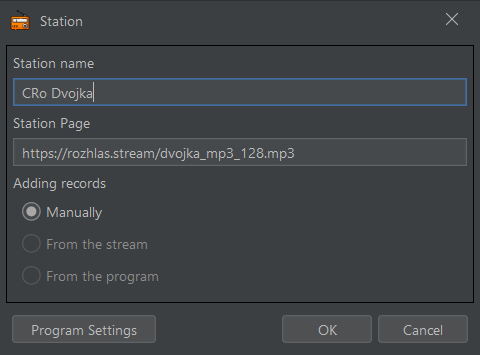<br>
  <small>Station dialog (dark theme).</small>
</p>

> Clicking **"Program Settings"** from this dialog opens the advanced parser.

### Advanced Program Guide Parser

This is RadioRec's most powerful feature, allowing you to scrape program data from any station's website. The `Program Settings dialog` has three tabs:

1. **Settings:** Define your parsing rules.

- **Program Page URL:** The website URL that lists the program schedule.
- **Page Time Zone:** The time zone of the program times listed on the site.
- **Root XPath:** An XPath expression to select the list of all program items (e.g., `//li[@class='program-item']`).
- **CSS Queries:** Use CSS selectors to find the **Title** and **Comment** within each root item.
- **Time Attributes:** Specify the HTML attribute names (e.g., `data-start`, `data-end`) and the **time format** (e.g., `yyyy-MM-dd'T'HH:mm:ss`) to extract start and finish times.

<p align="center">
  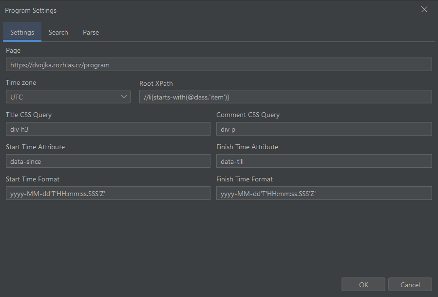<br>
  <small>Program Settings dialog: Settings (dark theme).</small>
</p>

> **Tip:** You can learn more about XPath here: [W3Schools – XPath Tutorial](https://www.w3schools.com/xml/xpath_intro.asp)

2. **Search:**

- Click **"Get Source"** to download the HTML of the program page.
- The source code is displayed with syntax highlighting to help you find the correct elements and attributes for your rules. You can even change the editor's color theme.

<p align="center">
  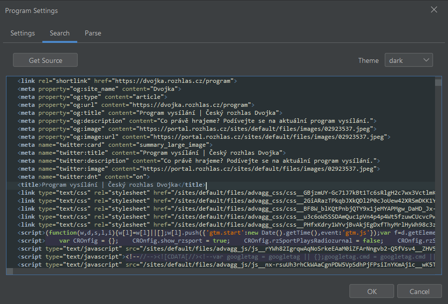<br>
  <small>Program Settings dialog: Search (dark theme).</small>
</p>

3. **Parse:**

- Click **"Parse"** to test your rules from the "Settings" tab on the downloaded HTML.
- The results are displayed in a table, showing you exactly what data will be imported. This lets you fine-tune your selectors until they are perfect.

<p align="center">
  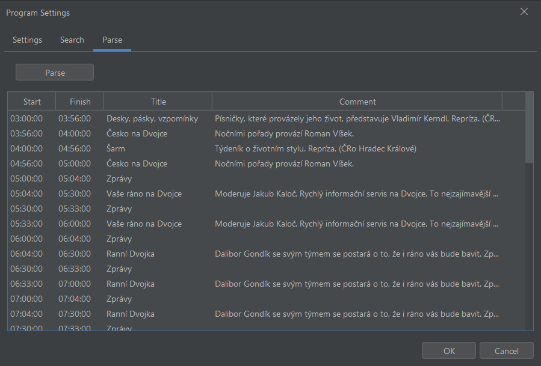<br>
  <small>Program Settings dialog: Parse (dark theme).</small>
</p>

### Recording Dialog

You can schedule a recording manually using the `Record dialog`, accessible via the plus icon on the **Record** tab. This is perfect for shows not in the program guide or for recording at specific times. You can set:

- **File Name:** (Optional) A custom file name.
- **Title & Comment:** Details about the recording.
- **Start & Finish Time:** A precise date and time picker for the recording's start and end.

<p align="center">
  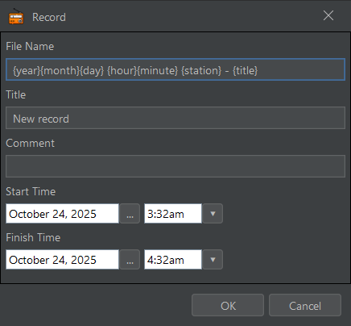<br>
  <small>Record dialog (dark theme).</small>
</p>

<div align="center">

Supported placeholders in custom file names:

| Placeholder | Description |
|-------------|-------------|
| `{year}`    | 4-digit year of the recording (e.g., `2025`) |
| `{month}`   | 2-digit month (e.g., `11`) |
| `{day}`     | 2-digit day (e.g., `12`) |
| `{hour}`    | Hour in 24-hour format (e.g., `14`) |
| `{minute}`  | Minute (e.g., `05`) |
| `{second}`  | Second (e.g., `32`) |
| `{station}` | Station name |
| `{title}`   | Program name from the recording dialog |
| `{comment}` | Program comment from the recording dialog |
| `{start}`   | Recording start time in `HHmmss` format (hours, minutes, seconds) |
| `{finish}`  | Recording finish time in `HHmmss` format (hours, minutes, seconds) |

</div>

-----

## Application Settings

The main `Settings dialog` provides deep customization, organized into four tabs, and is accessible by clicking the gear icon in the top-right corner.

1. **File:**

- **Stations Directory:** Where to save your station configuration files.
- **Records Directory:** The main folder for all your audio recordings.
- **Create Subfolders:** Automatically organize recordings into subfolders.
- **Subfolder Format:** Define the subfolder structure (e.g., `{station}/{year}/{month}`).
- **Filename Format:** Define the naming convention for recording files (e.g., `{year}{month}{day} {station} - {title}`).
- **Temp Directory:** A folder for temporary files during recording.

<p align="center">
  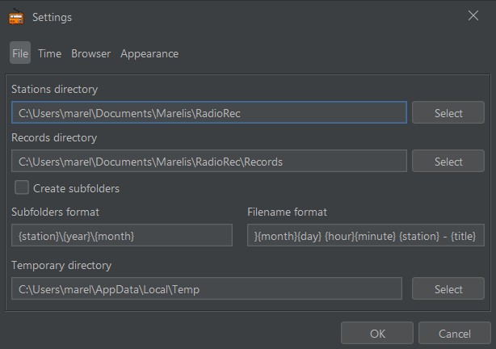<br>
  <small>Settings dialog: File (dark theme).</small>
</p>

<div align="center">

Available placeholders for folder and file names:

| Placeholder | Description |
|-------------|-------------|
| `{year}`    | 4-digit year of the recording (e.g., `2025`) |
| `{month}`   | 2-digit month (e.g., `11`) |
| `{day}`     | 2-digit day (e.g., `12`) |
| `{hour}`    | Hour in 24-hour format (e.g., `14`) |
| `{minute}`  | Minute (e.g., `05`) |
| `{second}`  | Second (e.g., `32`) |
| `{station}` | Station name |
| `{title}`   | Program name (from the station's program guide) |
| `{comment}` | Program commentary (from the station's program guide) |
| `{start}`   | Recording start time in `HHmmss` format (hours, minutes, seconds) |
| `{finish}`  | Recording finish time in `HHmmss` format (hours, minutes, seconds) |

</div>


2. **Time:**

- **Time Zone:** The time zone your application will use to display all times.
- **Time Format:** A custom format for displaying dates and times.
- **Append to Record Time:** Automatically add a buffer (e.g., `00m05s`) to the end of scheduled recordings.

<p align="center">
  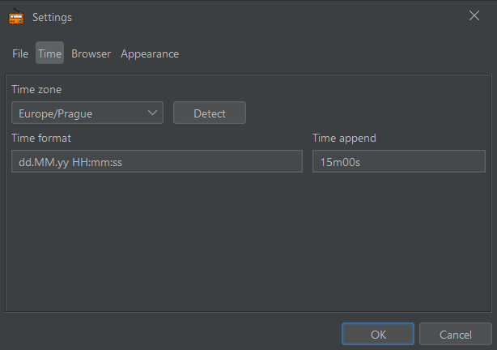<br>
  <small>Settings dialog: Time (dark theme).</small>
</p>

<div align="center">

**Time Format**

Description of fragments:

| Symbol | Meaning              | Example |
|--------|----------------------|---------|
| `dd`   | Day of the month     | 12      |
| `MM`   | Month of the year    | 11      |
| `yy`   | Year (last 2 digits) | 25      |
| `yyyy` | Year (4 digits)      | 2025    |
| `HH`   | Hour (24-hour)       | 14      |
| `mm`   | Minute               | 07      |
| `ss`   | Second               | 32      |

Example outputs for different formats:

| Format        | Example Output      | Description |
|---------------|---------------------|-------------|
| `dd.MM.yy HH:mm:ss` | 12.11.25 14:07:32 | Day.Month.Year Hour:Minute:Second |
| `yyyy-MM-dd HH:mm` | 2025-11-12 14:07   | Full year, Month, Day, Hour:Minute |

> Users can freely combine these fragments to define their own time display format.

</div>

3. **Browser:**

- **Web Browser Path:** The file path to your web browser's executable (e.g., `chrome.exe`).
- **Browser Command:** **(Crucial for parsing)** The command-line arguments needed to run the browser in headless mode and dump the page's HTML (e.g., `--headless --dump-dom`).

<p align="center">
  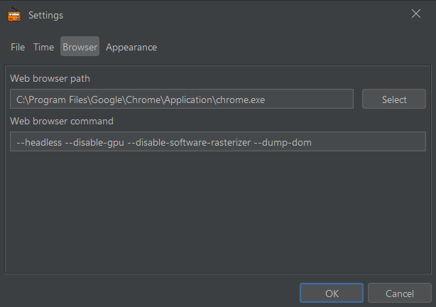<br>
  <small>Settings dialog: Browser (dark theme).</small>
</p>

4. **Appearance:**

- **Language:** Choose the application's display language.
- **Theme:** Switch between **Light** and **Dark** UI themes.
- **Size:** Change the global font size for the UI (Small, Medium, Large).

<p align="center">
  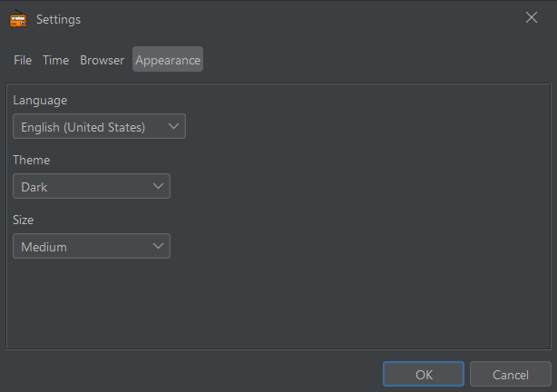<br>
  <small>Settings dialog: Appearance (dark theme).</small>
</p>

-----

## Available Radio Stations

- These are some of the radio stations currently used with **RadioRec**.  
- You can also create your own station files.  
- If you want, you can send your station file to the author [adlatus@marelis.cz](mailto:adlatus@marelis.cz), and it may be added to the official list.

| Country | Station File | Broadcast format | Station Name | Website |
|---------|--------------|:------:|--------------|---------|
| Czechia | [`ČRo Dvojka.radiorec-station`](https://raw.githubusercontent.com/MarelisAdlatus/radiorec/main/docs/v1.0/stations/%C4%8CRo%20Dvojka.radiorec-station) | MP3 | Český rozhlas Dvojka   | [dvojka.rozhlas.cz](https://dvojka.rozhlas.cz) |
| Czechia | [`ČRo Vltava.radiorec-station`](https://raw.githubusercontent.com/MarelisAdlatus/radiorec/main/docs/v1.0/stations/%C4%8CRo%20Vltava.radiorec-station) | MP3 | Český rozhlas Vltava   | [vltava.rozhlas.cz](https://vltava.rozhlas.cz) |

-----

## Technologies Used

This project is built with **Java 17** and managed using **Apache Maven**. It combines several key open-source libraries to deliver its features:

- ### Core Platform & Build

  - **[Java 17](https://adoptium.net/temurin/releases/?version=17):** The application is built using Java Development Kit version 17.
  - **[Apache Maven](https://maven.apache.org/):** Manages the project's build lifecycle and dependencies.
  - **[Maven Antrun Plugin](https://maven.apache.org/plugins/maven-antrun-plugin/):** Used during the build process to dynamically generate the list of available language bundles (`available-bundles.txt`).

- ### User Interface (GUI)

  - **[Java Swing](https://www.geeksforgeeks.org/java/introduction-to-java-swing/):** The foundational framework for the desktop GUI.
  - **[FlatLaf (by FormDev)](https://www.formdev.com/flatlaf):** A modern, flat look and feel library for Java Swing that provides the application's **Light** and **Dark** themes.
  - **[LGoodDatePicker](https://github.com/LGoodDatePicker/LGoodDatePicker):** A user-friendly and feature-rich date and time picker component used in the "Record Dialog" for scheduling.
  - **[RSyntaxTextArea](https://github.com/bobbylight/RSyntaxTextArea):** A powerful, syntax-highlighting text editor used for the HTML source viewer in the "Program Guide Parser" settings.

- ### Audio & Data Handling

  - **[Jsoup](https://jsoup.org):** The core library used to fetch, parse, and traverse the HTML of station program guides.
  - **[JLayer (by JavaZoom)](https://mvnrepository.com/artifact/javazoom/jlayer):** A library used for decoding and **playing** MP3 audio streams in real-time.
  - **[mp3agic (by mpatric)](https://github.com/mpatric/mp3agic):** A library for reading and manipulating MP3 metadata (ID3 tags), allowing the application to handle track information.
  - **[Apache Commons IO](https://commons.apache.org/proper/commons-io/):** A utility library that simplifies I/O operations, such as file and stream handling.

-----

## License

This project is licensed under the [Apache License 2.0](LICENSE).

:arrow_up: [Back to top](#top)